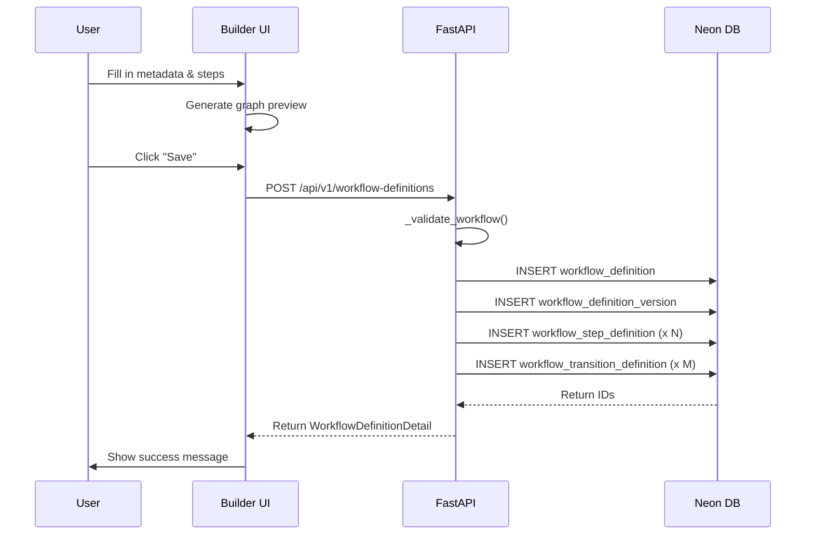

The Workflow Builder is a Next.js-based visual editor that lets you create, edit, and manage workflow definitions directly in the browser. It combines a form-based configuration UI with a live React Flow graph preview and persists definitions to Neon via the FastAPI backend.

## Architecture

The builder is implemented as a client-side React component located at:

- **UI Component**: `apps/web/components/workflow-builder.tsx` (1,822 lines)
- **Page Route**: `apps/web/app/builder/page.tsx`
- **API Backend**: `apps/api/src/api/workflows.py`
- **Schemas**: `apps/api/src/api/workflow_schemas.py`

<Note>
  The builder requires authentication via Better Auth. Unauthenticated users are redirected to `/sign-in`.
</Note>

## Key Features

### Visual Graph Preview

The builder uses **React Flow** (`@xyflow/react`) to render a live, read-only graph preview:

```tsx
// From workflow-builder.tsx:1166-1179
<ReactFlow
  defaultEdges={graphEdges}
  defaultNodes={graphNodes}
  fitView
  nodesDraggable={false}
  nodesFocusable={false}
  panOnDrag={false}
  proOptions={{ hideAttribution: true }}
  zoomOnDoubleClick={false}
  zoomOnPinch={false}
  zoomOnScroll={false}
>
  <Background gap={20} size={1} />
</ReactFlow>
```

- **Nodes** are generated from steps with custom styling (workflow-builder.tsx:393-409)
- **Edges** are generated from transitions with action-based animation (workflow-builder.tsx:412-432)
- The graph updates in real-time as you modify steps and transitions

### Real-Time Validation

Validation runs server-side in the `_validate_workflow` function (workflows.py:72-192):

<Steps>
  <Step title="Step code uniqueness">
    Ensures all `stepCode` values are unique across the definition (workflows.py:76-77)
  </Step>
  <Step title="Start step requirement">
    Exactly one step with `stepType: "start"` must exist (workflows.py:79-81)
  </Step>
  <Step title="Terminal step requirement">
    At least one terminal or end step must exist (workflows.py:83-87)
  </Step>
  <Step title="Transition target validation">
    All `fromStepCode` and `toStepCode` references must exist (workflows.py:93-99)
  </Step>
  <Step title="Unconditional self-loop detection">
    Prevents infinite loops without `conditionExpression` (workflows.py:106-112)
  </Step>
  <Step title="Reachability check">
    All steps must be reachable from the start step via DFS (workflows.py:132-150)
  </Step>
  <Step title="Cycle detection with guards">
    Detects cycles and ensures they have `maxVisitsPerInstance` guards (workflows.py:156-183)
  </Step>
</Steps>

### Builder Layout Persistence

The API stores both the canonical graph structure **and** the React Flow layout:

```python
# From workflows.py:23-57
def _derive_builder_layout(payload: WorkflowDefinitionCreate) -> dict:
    nodes = []
    edges = []
    
    for index, step in enumerate(payload.steps):
        nodes.append({
            "id": step.stepCode,
            "position": {"x": index * 220, "y": 120 if index % 2 == 0 else 40},
            "data": {
                "label": step.stepLabel,
                "stepType": step.stepType,
            },
        })
    
    for transition in payload.transitions:
        edges.append({
            "id": f"{transition.fromStepCode}-{transition.actionType}-{transition.toStepCode or 'terminal'}",
            "source": transition.fromStepCode,
            "target": transition.toStepCode,
            "label": transition.transitionLabel,
            "data": {
                "actionType": transition.actionType,
                "description": transition.description,
            },
        })
    
    return {
        "nodes": nodes,
        "edges": edges,
        "viewport": {"x": 0, "y": 0, "zoom": 1},
    }
```

<Note>
  If you don't provide a `builderLayout` in the payload, the API auto-generates a basic left-to-right layout.
</Note>

## Builder UI Sections

The builder page is divided into several card-based sections:

| Section | Description | Location |
|---------|-------------|----------|
| **Workflow Metadata** | Key, name, description, save/publish buttons | workflow-builder.tsx:1050-1155 |
| **Live Graph Preview** | React Flow visualization with nodes and edges | workflow-builder.tsx:1157-1182 |
| **Steps Section** | Configure step types, policies, associations, notifications | workflow-builder.tsx:1185-1662 |
| **Transitions Section** | Define source, target, action type, conditions | workflow-builder.tsx:1664-1748 |
| **Definitions Table** | Load existing workflows from Neon | workflow-builder.tsx:1751-1803 |
| **JSON Preview** | Canonical payload preview | workflow-builder.tsx:1805-1818 |

## Operations

### Creating a New Workflow

1. Fill in workflow key, name, and description
2. Configure steps and transitions
3. Click **Save workflow to Neon**
4. The API validates, creates a definition record, and inserts version 1

```typescript
// From workflow-builder.tsx:668-727
async function handleSave() {
  const response = await fetch(
    `${resolveApiBaseUrl()}/api/v1/workflow-definitions${isEditingExisting ? `/${selectedDefinitionId}` : ""}`,
    {
      method: isEditingExisting ? "PUT" : "POST",
      headers: {
        "content-type": "application/json",
        Authorization: `Bearer ${token}`,
      },
      body: JSON.stringify(payloadPreview),
    }
  )
}
```

### Updating an Existing Workflow

1. Click **Load** on any definition in the table
2. Modify steps, transitions, or metadata
3. Click **Save workflow to Neon** again
4. Creates a new version (v2, v3, etc.) without overwriting previous versions

<Warning>
  Saving creates a new **unpublished** version. You must click **Publish latest version** to make it active.
</Warning>

### Publishing a Workflow

Publishing marks the latest version as `is_published: true` and sets the definition status to `active`:

```python
# From workflows.py:812-866
@router.post("/{definition_id}/publish", response_model=WorkflowDefinitionCreateResponse)
def publish_workflow_definition(definition_id: str, ...):
    cursor.execute(
        "UPDATE workflow_definition_version SET is_published = false WHERE workflow_definition_id = %s",
        (definition_id,),
    )
    cursor.execute(
        "UPDATE workflow_definition_version SET is_published = true WHERE id = (...)",
    )
    cursor.execute(
        "UPDATE workflow_definition SET status = 'active', updated_at = now() WHERE id = %s",
        (definition_id,),
    )
```

### Duplicating a Workflow

The **Duplicate as new workflow** button clones the current definition:

```python
# From workflows.py:869-906
@router.post("/{definition_id}/clone", ...)
def clone_workflow_definition(definition_id: str, payload: WorkflowDefinitionCloneRequest, ...):
    clone_payload = _load_definition_create_payload(definition_id)
    clone_payload.key = payload.key
    clone_payload.name = payload.name
    if payload.description is not None:
        clone_payload.description = payload.description
```

<Note>
  The cloned workflow gets a new key like `vendor_onboarding_copy_123456` to avoid conflicts.
</Note>

## Data Flow



## Next Steps

<CardGroup cols={2}>
  <Card title="Creating Workflows" icon="plus" href="/builder/creating-workflows">
    Step-by-step guide to building your first workflow
  </Card>
  <Card title="Step Configuration" icon="gear" href="/builder/step-configuration">
    Configure step types, policies, and associations
  </Card>
  <Card title="Transitions" icon="arrow-right" href="/builder/transitions">
    Define routing logic with actions and conditions
  </Card>
  <Card title="Validation" icon="check" href="/builder/validation">
    Understand validation rules and error messages
  </Card>
</CardGroup>
