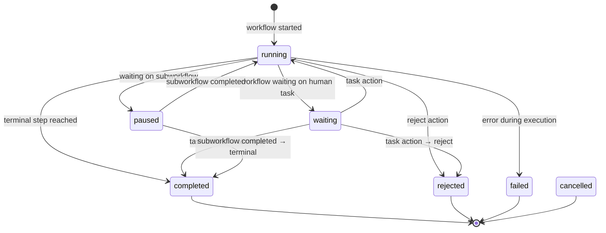

## Overview

The platform maintains a complete audit trail of workflow status transitions in the `workflow_status_history` table. Every time a workflow instance changes status, a new history record is created with the old status, new status, reason, and optional reference to the action that caused the change.

## Status History Records

Status history is recorded automatically by the `_record_status_history` function:

```python
# From runtime.py:59-79
def _record_status_history(
    cursor,
    workflow_instance_id,
    old_status: str | None,
    new_status: str,
    reason: str | None = None,
    changed_by_action_id=None,
) -> None:
    cursor.execute(
        """
        INSERT INTO workflow_status_history (
            workflow_instance_id,
            old_status,
            new_status,
            reason,
            changed_by_action_id
        )
        VALUES (%s, %s, %s, %s, %s)
        """,
        (workflow_instance_id, old_status, new_status, reason, changed_by_action_id),
    )
```

## Status Transitions

Workflow instances transition through these statuses:



## Common Status Change Scenarios

### Workflow Start

```python
# From runtime.py:1170-1177
_record_status_history(
    cursor,
    workflow_instance["id"],
    None,
    "running",
    reason="workflow started",
    changed_by_action_id=action_id,
)
```

**History Record:**

| Field | Value |
|-------|-------|
| `old_status` | `null` |
| `new_status` | `"running"` |
| `reason` | `"workflow started"` |
| `changed_by_action_id` | Action UUID |

### Entering Human Task

```python
# From runtime.py:508-524
old_status = workflow_instance["status"]
new_status = "waiting"
cursor.execute(
    """
    UPDATE workflow_instance
    SET status = %s, current_step_instance_id = %s, updated_at = now()
    WHERE id = %s
    """,
    (new_status, step_instance["id"], workflow_instance["id"]),
)
_record_status_history(
    cursor,
    workflow_instance["id"],
    old_status,
    new_status,
    reason="workflow waiting on human task",
)
```

**History Record:**

| Field | Value |
|-------|-------|
| `old_status` | `"running"` |
| `new_status` | `"waiting"` |
| `reason` | `"workflow waiting on human task"` |
| `changed_by_action_id` | `null` |

### Task Action Advancing Workflow

```python
# From runtime.py:1489-1496
_record_status_history(
    cursor,
    task_row["workflow_instance_id"],
    old_status,
    new_status,
    reason=f"task action {action_type}",
    changed_by_action_id=action_id,
)
```

**History Record:**

| Field | Value |
|-------|-------|
| `old_status` | `"waiting"` |
| `new_status` | `"completed"` |
| `reason` | `"task action approve"` |
| `changed_by_action_id` | Action UUID |

### Terminal Step Reached

```python
# From runtime.py:576-582
_record_status_history(
    cursor,
    workflow_instance["id"],
    old_status,
    new_status,
    reason="terminal step reached",
)
```

**History Record:**

| Field | Value |
|-------|-------|
| `old_status` | `"running"` or `"waiting"` |
| `new_status` | `"completed"` or `"rejected"` |
| `reason` | `"terminal step reached"` |
| `changed_by_action_id` | `null` |

### Subworkflow Pause and Resume

When a workflow starts a subworkflow:

```python
# From runtime.py:912-918
_record_status_history(
    cursor,
    workflow_instance["id"],
    workflow_instance["status"],
    "paused",
    reason="waiting on subworkflow",
)
```

When the subworkflow completes:

```python
# From runtime.py:843-849
_record_status_history(
    cursor,
    parent_workflow_instance["id"],
    "paused",
    "running",
    reason="subworkflow completed",
)
```

## Status History Schema

The `workflow_status_history` table includes:

```sql
CREATE TABLE workflow_status_history (
    id UUID PRIMARY KEY DEFAULT gen_random_uuid(),
    workflow_instance_id UUID NOT NULL REFERENCES workflow_instance(id),
    old_status TEXT,
    new_status TEXT NOT NULL,
    reason TEXT,
    changed_by_action_id UUID REFERENCES workflow_action(id),
    created_at TIMESTAMP WITH TIME ZONE DEFAULT now()
);
```

<Note>
The `old_status` can be `NULL` for the initial status transition when the workflow is created.
</Note>

## Querying Status History

To retrieve the full status history for a workflow instance:

```sql
SELECT
    wsh.id,
    wsh.old_status,
    wsh.new_status,
    wsh.reason,
    wsh.created_at,
    wa.action_type,
    wa.actor_user_id,
    wa.remark_text
FROM workflow_status_history wsh
LEFT JOIN workflow_action wa ON wa.id = wsh.changed_by_action_id
WHERE wsh.workflow_instance_id = 'your-instance-uuid'
ORDER BY wsh.created_at ASC;
```

**Example Result:**

| created_at | old_status | new_status | reason | action_type | actor_user_id |
|------------|------------|------------|--------|-------------|---------------|
| 2026-03-14 10:30:00 | null | running | workflow started | start | user-123 |
| 2026-03-14 10:30:01 | running | waiting | workflow waiting on human task | null | null |
| 2026-03-14 10:35:00 | waiting | waiting | task action approve | approve | manager-456 |
| 2026-03-14 10:40:00 | waiting | completed | task action approve | approve | cfo-789 |

## Linking Actions to Status Changes

The `changed_by_action_id` field creates a direct link between status transitions and the actions that caused them:

```python
# From runtime.py:1147-1177 (workflow start)
cursor.execute(
    """
    INSERT INTO workflow_action (
        workflow_instance_id,
        action_type,
        actor_user_id,
        actor_type,
        payload
    )
    VALUES (%s, 'start', %s, 'user', %s)
    RETURNING id
    """,
    (
        workflow_instance["id"],
        user.user_id,
        Json(
            {
                "workflowDefinitionKey": version["key"],
                "businessKey": payload.businessKey,
            }
        ),
    ),
)
action_id = cursor.fetchone()["id"]

_record_status_history(
    cursor,
    workflow_instance["id"],
    None,
    "running",
    reason="workflow started",
    changed_by_action_id=action_id,
)
```

This allows you to trace exactly which user action or system event caused each status transition.

## Status History in the UI

While the current implementation doesn't expose a dedicated status history endpoint, the information is embedded in the workflow instance detail response via the `actions` array.

Future enhancements could include:

- **GET /api/v1/workflow-instances/:id/status-history** - Dedicated endpoint for status history
- **Timeline view** - Visual timeline showing status transitions alongside step visits and actions
- **Audit export** - CSV or JSON export of complete status history for compliance

## Example Timeline

For a typical invoice approval workflow:

```
10:30:00 | null → running        | workflow started                  | user: requester
10:30:01 | running → waiting      | workflow waiting on human task    | system
10:35:00 | waiting → waiting      | task action approve               | user: manager
10:35:01 | waiting → waiting      | workflow waiting on human task    | system
10:40:00 | waiting → completed    | task action approve               | user: cfo
```

Each transition is timestamped and linked to the actor, making it easy to audit workflow progression.

## Related Endpoints

- [Workflow Monitoring](/runtime/workflow-monitoring)
- [Task Approvals](/runtime/approvals)
- [Starting Workflows](/runtime/starting-workflows)
